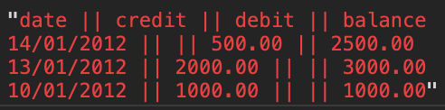

# Bank tech Test

  - clone the repo
  - open index.html in a browser and open the console

  paste the following into the console

  statement = new Statement 
  bank = new Bank(statement)
  bank.deposit(1000, "10/01/2012")
  bank.deposit(2000, "13/01/2012")
  bank.withdraw(500, "14/01/2012")
  bank.printStatement()

## Approach
  Create 2 classes bank which deals with transaction logic and statement  that deals with the logic and creation of the bank statement. 

## How Code Is Structured

  Bank inherits from statement so statement logic is encapsulated

## The Output

## Requirements

  - You should be able to interact with your code via a REPL like IRB or the JavaScript console. (You don't need to implement a command line interface that takes input from STDIN.)
  - Deposits, withdrawal.
  - Account statement (date, amount, balance) printing.
  - Data can be kept in memory (it doesn't need to be stored to a database or anything).

## Acceptance criteria

  - Given a client makes a deposit of 1000 on 10-01-2012
  - And a deposit of 2000 on 13-01-2012
  - And a withdrawal of 500 on 14-01-2012
  - When she prints her bank statement
  - Then she would see

date || credit || debit || balance
14/01/2012 || || 500.00 || 2500.00
13/01/2012 || 2000.00 || || 3000.00
10/01/2012 || 1000.00 || || 1000.00
